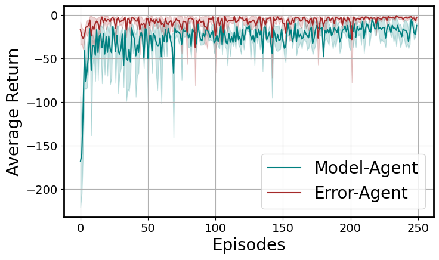
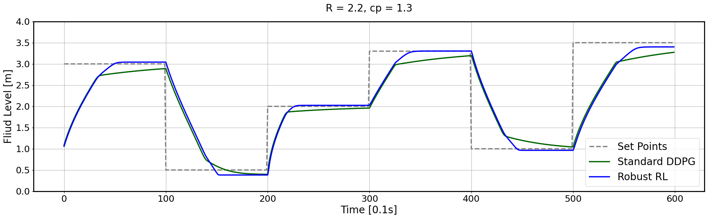
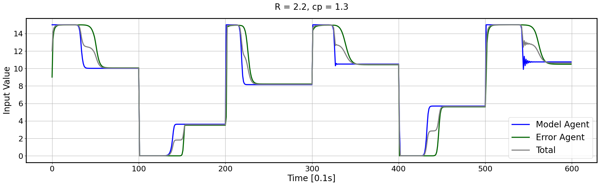

# Robust Reinforcement Learning for Spherical Tank Level Control

This repository contains the core method from my master's thesis project: Safe Learning: Reinforcement Leanring for Secure Control. The work was later published as the paper **"Robust tube-based reinforcement learning control for systems with parametric uncertainty"** in *European Journal of Control*, 86 (2025), 101326, DOI: `10.1016/j.ejcon.2025.101326`.

The code focuses on the spherical tank case study used to evaluate the method. The controller is trained on a nominal model but must remain effective when the real process has uncertain physical parameters, including tank radius and discharge coefficient.

## Paper Summary

Classical reinforcement learning controllers can perform well in simulation but degrade when the deployed process differs from the training model. In a spherical tank, this mismatch is important because the water-level dynamics are nonlinear and depend directly on physical parameters. A controller trained only for the nominal tank can therefore lose tracking accuracy when the real tank geometry or discharge behavior changes.

The proposed method uses a two-agent DDPG structure:

1. **Model Agent** learns the nominal control policy for the simulated spherical tank.
2. **Error Agent** learns a compensating action from the mismatch between the nominal model state and the uncertain real-process state.

The final control input combines both actor outputs. This design keeps the nominal policy useful while adding a learned correction term for uncertainty, improving robustness in setpoint-tracking experiments.

## Result Showcase

Training records show how the model agent and error agent learn complementary behavior under uncertainty.



The default evaluation tests setpoint tracking under parameter mismatch. The robust two-agent controller follows changing setpoints more reliably than the standard DDPG baseline in the uncertain process.



The learned correction appears directly in the control signal: the model-agent action provides the nominal input, while the error-agent action adjusts the total input for the uncertain tank.



## Repository Structure

- `robust_rl_tank/`: reusable Python package for the environment, DDPG agents, neural networks, replay buffers, training, and evaluation.
- `scripts/`: command-line entry points for training, evaluating pretrained controllers, and plotting saved training curves.
- `models/`: default pretrained actor checkpoints used by the paper evaluation logic.
- `data/`: saved training metrics from the uncertainty experiment.
- `assets/`: exported result figures from the experiments.
- `tests/`: smoke tests for the environment, scaling utilities, and pretrained-model evaluation path.

## Installation

```bash
python3 -m venv .venv
source .venv/bin/activate
pip install -e .
pip install pytest
```

If you do not want editable installation, install the dependencies directly:

```bash
pip install -r requirements.txt
```

## Quick Reproduction

Run the pretrained setpoint-tracking evaluation:

```bash
python scripts/evaluate.py
```

This writes:

- `results/setpoint_tracking.csv`
- `results/setpoint_tracking.png`
- `results/control_actions.png`

The default checkpoints are:

- `models/default_model_agent.pth`
- `models/default_error_agent.pth`

## Plot Training Curves

```bash
python scripts/plot_training.py
```

This reads `data/record_training_data.csv` and writes `results/training_returns.png`.

## Train New Controllers

```bash
python scripts/train.py --episodes 250 --batch-size 256 --seed 7
```

Training writes new checkpoints to `models/` and a new training-history CSV to `data/`. To avoid overwriting the default paper checkpoints, the script defaults to `actor-model-new.pth` and `actor-error-new.pth`.

## Test

```bash
pytest
```

The tests intentionally stay lightweight. They verify that the environment steps, scaling functions preserve the expected ranges, and the pretrained evaluation path can load the default models.

## Checkpoint Format

The pretrained actor files in `models/` are stored as PyTorch `state_dict` checkpoints with lightweight architecture metadata. This keeps the project portable across directory layouts and avoids relying on notebook-era import paths.
